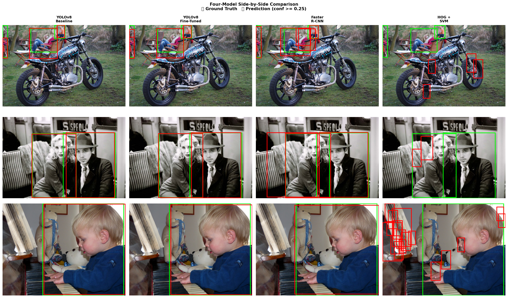
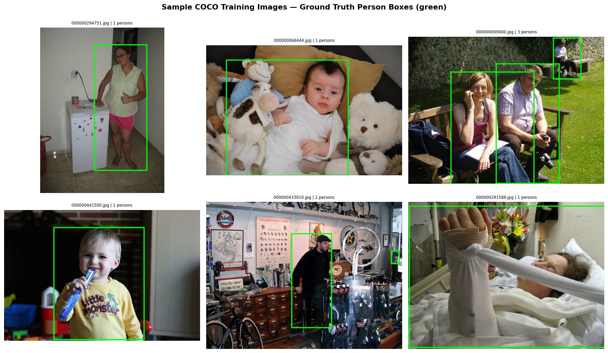
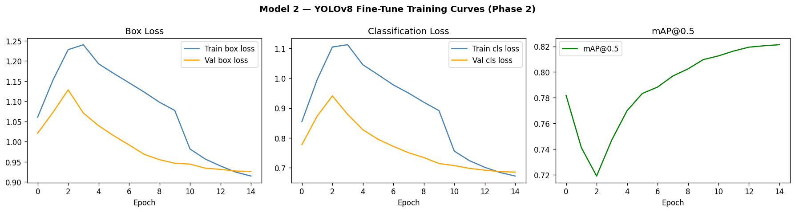
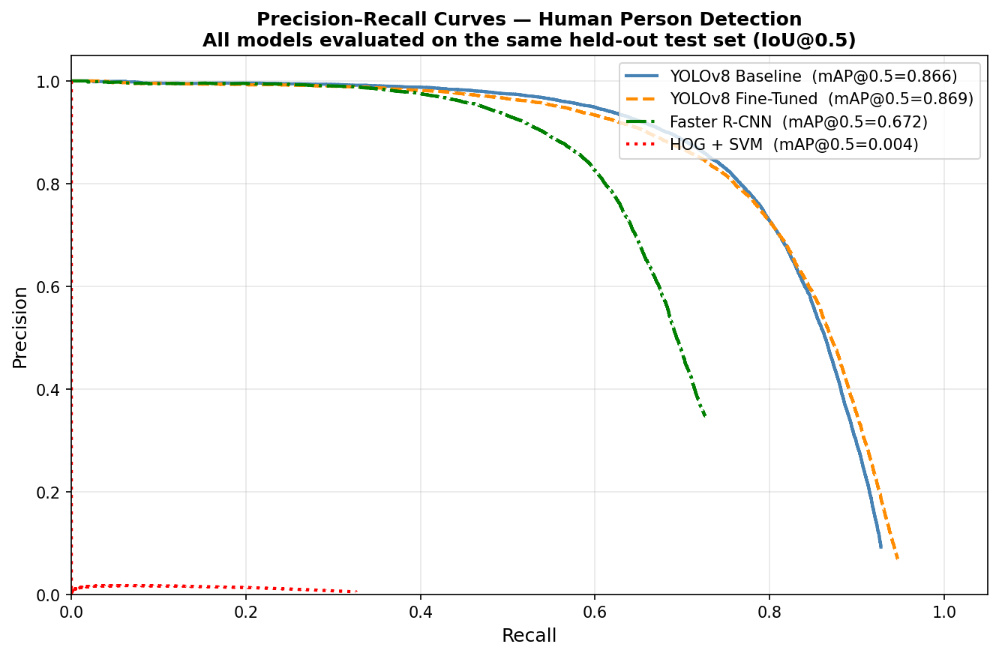
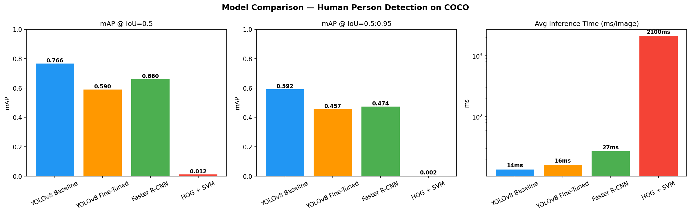

<div align="center">

# 🧍 Human Person Detection — Deep Learning vs Traditional Machine Learning

**A rigorous, reproducible benchmark of four detection paradigms on the COCO 2017 person class**

`WMG9B7-15 — Artificial Intelligence & Deep Learning · Individual Assessment 2025/26`

[](https://www.python.org/)
[](https://pytorch.org/)
[](https://github.com/ultralytics/ultralytics)
[](https://cocodataset.org/)
[](#-reproducibility)
[](#-how-to-run)

</div>

---

## 📌 Overview

This project develops and **critically evaluates a complete human-detection system**, pitting modern deep learning against a classical machine-learning baseline under an identical, strictly held-out evaluation protocol. Four detectors are implemented end-to-end, trained or fine-tuned on the same COCO 2017 person split, and scored with the official `pycocotools` `COCOeval` — then compared not only on accuracy and speed, but also on **confidence calibration** and **explainability**.

| # | Model | Paradigm | Role |
|:-:|-------|----------|------|
| 1 | **YOLOv8s** (pretrained) | Deep Learning · single-stage | Strong off-the-shelf baseline |
| 2 | **YOLOv8s** (fine-tuned, person-only) | Deep Learning · single-stage | Two-phase transfer learning |
| 3 | **Faster R-CNN** (ResNet-50 FPN) | Deep Learning · two-stage | Accuracy-oriented reference |
| 4 | **HOG + Linear SVM** | Traditional ML | Dalal–Triggs classical baseline |

> The goal is a fair, empirically grounded answer to a deceptively simple question: **how much does modern deep learning actually buy you for person detection — and at what cost in speed, calibration, and interpretability?**

---

## 🏆 Headline Results

All models evaluated on the **same 10,000-image held-out test split** (seed 42) using `pycocotools COCOeval`.

| Model | Type | mAP@0.5 | mAP@0.5:0.95 | AR@100 | ECE ↓ | Latency (ms/img) |
|-------|:----:|:-------:|:------------:|:------:|:-----:|:----------------:|
| **YOLOv8s — Baseline** | DL | **0.766** | **0.592** | **0.630** | 0.109 | 13.6 |
| YOLOv8s — Fine-Tuned | DL | 0.590 | 0.457 | 0.488 | **0.084** | 16.1 |
| Faster R-CNN R50-FPN | DL | 0.660 | 0.474 | 0.519 | — | 26.8 |
| HOG + SVM | TML | 0.012 | 0.002 | 0.062 | — | 2099.8 |

<div align="center">



</div>

### Key takeaways

- **Deep learning dominates by two orders of magnitude.** Every DL model beats HOG+SVM by a vast margin on mAP (0.77 vs 0.01) while running **~150× faster** at inference. The classical sliding-window pipeline averages **~2.1 seconds per image** — infeasible for real-time use.
- **The pretrained YOLOv8s baseline is the single strongest detector here**, leading on mAP@0.5, mAP@0.5:0.95 and AR@100 — a reminder that a high-quality general model is a very hard baseline to beat.
- **Fine-tuning improved calibration, not raw mAP.** Person-only fine-tuning reduced Expected Calibration Error (**ECE 0.109 → 0.084**, Δ −0.025) — its confidence scores became more trustworthy — but overall mAP fell. The drop is concentrated in **small objects** (small-object mAP collapsed from 0.299 → 0.055), a direct consequence of the `min-area = 1000 px²` annotation filter applied during fine-tuning, which removed tiny persons from the training signal. This is an honest, instructive trade-off rather than a uniform "fine-tuning wins" story.
- **Single-stage vs two-stage:** YOLOv8s is both faster (13.6 ms) and more accurate than Faster R-CNN (26.8 ms) on this person task; the two-stage detector's theoretical localisation edge did not translate into higher mAP here.

---

## 🗂️ Repository Structure

```
AIDL_Idividual/
├── Human_Detection_Enhanced.ipynb              # Main notebook (lightweight, outputs stripped)
├── 1777574367945_Human_Detection_Enhanced_2.ipynb  # Enhanced run (full outputs, latest results)
├── critical_reflection_report.docx             # ~2,800-word critical reflection report
├── yolov8s.pt                                  # YOLOv8s pretrained weights (baseline)
├── test.JPG / test2.jpg                        # Sample inference images
│
└── human_detection_project/
    ├── models/
    │   ├── frcnn_best.pth                       # Faster R-CNN weights (Git LFS, ~159 MB)
    │   ├── hog_svm_pipeline.joblib             # Trained HOG+SVM pipeline
    │   └── yolo_finetune/
    │       ├── phase1/   # Head-only warm-up (backbone frozen) — weights, curves, confusion matrices
    │       └── phase2/   # Full-network fine-tune — weights, curves, confusion matrices
    └── results/
        ├── comparison_table.json               # Final metrics for all 4 models
        ├── dataset_splits.json                 # Reproducible train/val/test image IDs (seed 42)
        ├── montage.png
        └── visualisations/                     # EDA_*, CALIB_*, EXPLAIN_*, prediction & failure grids
```

---

## 🔬 Methodology

### Dataset — COCO 2017, person class

- **Source:** COCO 2017 `train2017`, filtered to the `person` category (category ID 1).
- **Splits (seed 42, serialised to `dataset_splits.json`):** **50,000** train · **10,000** validation · **10,000** held-out test.
- **Annotation filter:** bounding boxes below **1,000 px²** are dropped — these are predominantly blurred, occluded or low-resolution instances that inject noisy gradients.
- **EDA findings:** 122,240 person boxes · median **2 persons/image** · median box **87 × 165 px** · median image **640 × 480**. Long-tailed persons-per-image distribution motivates mosaic augmentation.

<div align="center">



</div>

### 1 & 2 · YOLOv8s — baseline & two-phase fine-tuning

The baseline is evaluated **as-is** (no retraining). Fine-tuning uses a deliberate **two-phase transfer-learning schedule** to avoid catastrophic forgetting:

| Phase | Backbone | Epochs | LR (`lr0`) | Image size | Batch |
|-------|----------|:------:|:----------:|:----------:|:-----:|
| **1 — Warm-up** | Frozen (`freeze=10`), head only | 8 | 0.001 | 640 | 16 |
| **2 — Full fine-tune** | Fully unfrozen | 22 | 0.0005 | 640 | 16 |

Augmentation via the Ultralytics pipeline: horizontal flip (p=0.5), scale jitter (±50%), HSV colour jitter, and **mosaic** (four images composited) to expose the model to varied crowd densities.

<div align="center">



</div>

### 3 · Faster R-CNN (ResNet-50 FPN)

Initialised from torchvision `COCO_V1` weights with the classifier head replaced by a **2-class** (background + person) predictor. Optimised with **SGD** (momentum 0.9, weight decay 1e-4) and a step LR scheduler. Batch size constrained to 4 by GPU memory (two-stage detectors retain dense per-anchor feature maps).

### 4 · HOG + Linear SVM (Dalal–Triggs, 2005)

Faithful reproduction of the canonical pedestrian detector: **9 gradient orientations**, **8×8 px cells**, **2×2 block** L2-Hys normalisation, **128×64** detection window. A `LinearSVC` (C=0.01) is trained on **5,000 positive / 5,000 negative** patches (negatives mined by IoU < 0.3). Inference uses a **sliding window over an image pyramid** with non-maximum suppression.

---

## 📊 Evaluation: beyond mAP

Detection accuracy alone is an incomplete picture, so every model is assessed on three axes:

1. **Accuracy & speed** — `COCOeval` mAP@0.5, mAP@0.5:0.95, mAP@0.75, AR@100, full **precision–recall curves**, and wall-clock latency.
2. **Calibration** — reliability diagrams with **Expected Calibration Error (ECE)**; a well-calibrated 0.8-confidence detection should be correct ~80% of the time.
3. **Explainability** — model-specific saliency: YOLO **SPPF activation maps**, Faster R-CNN **Layer-4 activations**, and the interpretable **HOG+SVM weight template** (a genuine advantage of the classical model in regulated settings).

<div align="center">




</div>

---

## 🚀 How to Run

> **Environment:** Google Colab with a **T4 GPU** runtime is recommended (`Runtime → Change runtime type → T4 GPU`).

1. Open **`Human_Detection_Enhanced.ipynb`** in Colab.
2. Run **Section 1 (Setup)** first — it installs all dependencies.
3. Run each section **sequentially, top to bottom**. The notebook is self-contained and downloads COCO automatically.
4. **Estimated runtime:** ~6–10 hours on a T4 (HOG sliding-window inference is the long pole — reduce `HOG_TEST_LIMIT` in Section 6.5 for a fast development pass).

Pretrained artefacts are included so individual sections can be re-evaluated without retraining: YOLO weights under `human_detection_project/models/yolo_finetune/`, `frcnn_best.pth` (Git LFS), and `hog_svm_pipeline.joblib`.

```bash
# Clone (Git LFS required for the Faster R-CNN weights)
git lfs install
git clone https://github.com/BOBMSH/AIDL_Idividual.git
```

---

## 🔁 Reproducibility

A single global seed (**`SEED = 42`**) is propagated across Python, NumPy, PyTorch and CUDA. Train/val/test image IDs are serialised to `results/dataset_splits.json`, so any reviewer can reconstruct **byte-identical splits** and reproduce every reported number — a prerequisite for a meaningful cross-paradigm comparison.

---

## ⚖️ Impact, Ethics & Environment

Person detection is **dual-use**. It powers genuinely beneficial systems — fall detection in elder care, crowd-safety monitoring, pedestrian safety in autonomous vehicles — but the same capability enables mass surveillance, and the **EU AI Act (2024)** classifies biometric/remote-surveillance systems as high-risk. Two concerns are made explicit:

- **Demographic bias:** COCO 2017 is large but not demographically balanced; underrepresented groups risk systematically lower recall and reduced visibility to downstream systems.
- **Environmental cost:** fine-tuning on ~50k images draws an estimated **0.5–1.5 kWh** on a single T4. At inference, YOLOv8s is the clear sustainable choice — a single 640 px forward pass costs far less energy than Faster R-CNN's two-stage pass.

---

## 🔮 Future Directions

- **Foundation / zero-shot detection** — Grounding DINO, CLIP and SAM 2 to detect persons from natural-language prompts without class-specific fine-tuning.
- **Transformer detectors** — DETR / DINO / Co-DETR to remove anchor-design inductive bias (the EDA shows some GT boxes fall outside default anchor scales).
- **Federated learning** — privacy-preserving fine-tuning across edge cameras without centralising raw imagery.
- **Event-based / neuromorphic vision** — spiking networks over event-camera streams for low-power, low-light, high-frame-rate detection.

---

## 📚 Citation & Acknowledgements

Built on [Ultralytics YOLOv8](https://github.com/ultralytics/ultralytics), [torchvision Faster R-CNN](https://pytorch.org/vision/), [scikit-image HOG](https://scikit-image.org/) + [scikit-learn](https://scikit-learn.org/), and the [COCO 2017](https://cocodataset.org/) dataset. Core references include Dalal & Triggs (2005), Ren et al. (2015), Jocher et al. (2023), Lin et al. (2014) and Guo et al. (2017) — see `critical_reflection_report.docx` for the full bibliography and the extended critical analysis.

<div align="center">

*WMG9B7-15 — Artificial Intelligence & Deep Learning · Individual Assessment 2025/26*

</div>
