# Critical Reflection Report

**Human Person Detection: Deep Learning vs Traditional Machine Learning**

WMG9B7-15 — Artificial Intelligence and Deep Learning — Individual Assessment 2025/26

Ubay Al Shamali (Student ID: 5756394)

AI scale used: AI Collaboration.

---

## Table of contents

1. Introduction and problem context
2. Real-world relevance and business framing
3. Dataset and exploratory analysis
4. Traditional machine learning versus deep learning
5. Model architecture and experimental design
6. Evaluation, calibration, and interpretability
7. Empirical results and discussion
8. AI assistant usage
9. Impact, ethics, and sustainability
10. Future trends and research opportunities
11. Conclusion

References

Appendix A — Dataset and exploratory data analysis (extended)
Appendix B — Per-model training, predictions and saliency
Appendix C — Calibration in detail
Appendix D — Failure-mode analysis
Appendix E — Engineering obstacles and how they were resolved

---

## 1. Introduction and problem context

Detecting and localising human beings in unconstrained imagery is a long-standing computer vision problem with direct safety, healthcare, retail, and accessibility consequences (Dollár et al., 2012; Cristani et al., 2020). Despite two decades of methodological progress, in-the-wild person detection remains non-trivial because pose, scale, occlusion, illumination, clothing, and demographic appearance vary across orders of magnitude (Benenson et al., 2015). This project develops and critically evaluates a four-model person detector on the COCO 2017 benchmark (Lin et al., 2014): a Histograms-of-Oriented-Gradients pipeline with a linear support vector machine (HOG+SVM) representing the canonical traditional machine-learning (TML) baseline (Dalal and Triggs, 2005); a pretrained YOLOv8s single-stage detector (Jocher, Chaurasia and Qiu, 2023); a two-phase fine-tuned YOLOv8s adapted to the person class only; and a Faster R-CNN with a ResNet-50 FPN backbone (Ren et al., 2017). The submission is a 72-cell Jupyter notebook covering dataset preparation, exploratory data analysis (EDA), training, evaluation, calibration, explainability, and failure analysis. The report that follows critically reflects on those choices, frames them in the broader research and societal context, and reports headline numbers from the final audited evaluation.

## 2. Real-world relevance and business framing

Person detection underpins a sizeable and growing commercial market: video analytics is forecast to grow from USD 12.7 billion in 2024 to USD 37.8 billion by 2030 at a 19.5% compound annual growth rate, driven primarily by retail, smart cities, and security (Grand View Research, 2025). Within that market, healthcare deployments such as fall detection in elder-care environments rely on robust real-time person localisation to reduce response time after adverse events (Adhikari, Bouchachia and Nait-Charif, 2017), while public-health applications like automated social-distancing monitoring became operationally relevant during COVID-19 (Cristani et al., 2020). The cross-cutting requirement is the same in every one of these settings: a detector that is *accurate enough* to be trusted, *fast enough* to act in real time, and *calibrated* enough to support a downstream decision rule. The choice of algorithm has therefore to be defended on all three axes simultaneously, not on a single accuracy figure in isolation.

## 3. Dataset and exploratory analysis

COCO 2017 was selected as the development corpus because its images are sourced from everyday photography and capture the diversity of scene types, lighting, and crowd densities a deployed person detector must tolerate (Lin et al., 2014). After filtering to person annotations with non-crowd, non-degenerate boxes of side ≥ 32 px and area ≥ 1,000 px² — a filter that removes only the tiniest annotations whose information content is dominated by JPEG noise — 57,909 unique images remain. These are split 80/10/10 into 46,327 train, 5,791 validation, and 5,791 test images using a fixed seed (42) and a serialised `dataset_splits.json`, which seeds the split deterministically across Python, NumPy, PyTorch and CUDA generators in line with current reproducibility guidance (Pineau et al., 2021). All four models are evaluated against the same 5,791-image test partition with the official `pycocotools` `COCOeval` implementation. Figure 1 shows representative training images with their ground-truth person boxes. The bounding-box statistics in Appendix A reveal a heavy-tailed scale distribution (median height 165 px, p99 > 500 px) and a person-per-image distribution with a long tail of crowded scenes — both axes of variation that any deployed detector must absorb.

## 4. Traditional machine learning versus deep learning

### 4.1 The HOG+SVM paradigm and why it cannot scale to COCO

The HOG+SVM pipeline replicates the Dalal–Triggs pedestrian detector that dominated person detection until the deep-learning inflection point (Dalal and Triggs, 2005). The feature representation is hand-engineered (8×8 cells, nine orientation bins, 2×2 L2-Hys block normalisation, 1,764-dim descriptor over a fixed 128×64 window); the classifier is a linear SVM, which solves a convex max-margin objective with a unique global optimum and a directly interpretable weight vector (Cortes and Vapnik, 1995); and detection itself is patch-level binary classification across a dense sliding-window pyramid. The pipeline is *legible* — every step admits a closed-form interpretation — but inherits four limitations that prove fatal on COCO. (i) The descriptor is scale- and pose-locked: a 128×64 silhouette template cannot represent a seated, kneeling, or partially occluded person, and the pyramid only partially compensates because each scale rescans the same template. (ii) The classifier has no spatial reasoning across the patch — it treats the descriptor as a flat vector — which is why the Deformable Part-Based Model later partially closed this gap with latent SVMs and part templates (Felzenszwalb et al., 2010). (iii) Decision-function scores are unbounded ranks rather than probabilities, so they require post-hoc Platt scaling before they can be treated as confidences (Platt, 1999); without it, COCOeval cannot integrate the precision–recall curve correctly. (iv) The training objective (patch-level margin) is misaligned with the evaluation objective (per-image mAP), so any SVM improvement does not necessarily translate into an mAP improvement. The 0.004 mAP@0.5 reported in §7 is the cumulative consequence of these four limitations, not a tuning oversight; it is the central empirical evidence that the TML paradigm is a category mismatch for unconstrained person detection.

### 4.2 The deep learning paradigm

The 2012 AlexNet result (Krizhevsky, Sutskever and Hinton, 2012) demonstrated that hierarchical, end-to-end-learned features could close the long-standing accuracy gap on large-scale visual recognition, and ResNet's residual connections (He et al., 2016) made very deep networks reliably trainable. Object detection inherited this progress in two lineages. Two-stage detectors (Fast R-CNN; Faster R-CNN with a Region Proposal Network) decouple region proposal from classification and tend to localise small or occluded objects more accurately at the cost of latency (Girshick, 2015; Ren et al., 2017). Single-stage detectors directly regress boxes and class scores from feature-map positions and prioritise inference speed (Redmon et al., 2016); YOLOv8 adds an anchor-free decoupled head and a CSPDarknet–PAN feature pyramid (Jocher, Chaurasia and Qiu, 2023). The Faster R-CNN baseline used here augments its ResNet-50 backbone with a Feature Pyramid Network so that small persons remain detectable at high resolution (Lin et al., 2017). The unifying contrast with HOG+SVM is representational: deep features are learned jointly with the detection objective from raw pixels, removing the need to hand-design what a person silhouette should look like (LeCun, Bengio and Hinton, 2015; Goodfellow, Bengio and Courville, 2016).

### 4.3 Why deep learning is the correct paradigm for this problem

The DL paradigm is justified on three grounds that §7 quantifies rather than merely asserts. (i) *Representation*: COCO contains people in poses, occlusions, and crowd densities that the HOG template was never designed to handle (Benenson et al., 2015); a deep backbone learns scale- and pose-equivariant features automatically rather than relying on a fixed template. (ii) *End-to-end optimisation*: deep detectors optimise classification, regression and (for YOLO) objectness losses jointly, with the gradient signal flowing back through the feature extractor (Goodfellow, Bengio and Courville, 2016) — the train/eval mismatch that hobbles HOG+SVM is essentially closed. (iii) *Throughput*: sliding-window inference is computationally prohibitive at scale, while a single-stage DL detector processes a 640-pixel image in single-digit milliseconds on a modern GPU. The empirical gap on this benchmark is therefore not a few mAP points but two orders of magnitude on accuracy and two-and-a-half on latency.

## 5. Model architecture and experimental design

### 5.1 YOLOv8 fine-tuning strategy

The YOLOv8 fine-tune adopts a two-phase schedule motivated by transfer-learning theory (Yosinski et al., 2014). Phase 1 freezes the first ten backbone stages and trains only the detection head, which protects the pretrained features from large gradients arising from a freshly-initialised single-class head; Phase 2 unfreezes the entire backbone and trains for ten further epochs at a cosine-decayed learning rate of 1×10⁻³ → 6.8×10⁻⁵, with `close_mosaic=5` re-introducing un-augmented data in the final epochs to sharpen confidence predictions. Two engineering decisions carry most of the empirical weight: the Phase-1 backbone was switched from `yolov8n.pt` to `yolov8s.pt` after an audit found a backbone-size mismatch with the saved checkpoint, and the warmup learning rate was clamped to `lr0` (rather than the YOLO default `warmup_bias_lr=0.1`, which ramps to ~0.029 in epoch 1 and silently destroys pretrained features). The fine-tune's natural operating point is `imgsz=800` — defensible because the single-class head has fewer outputs and can afford the extra spatial resolution at +1 ms latency.

### 5.2 Faster R-CNN configuration

The Faster R-CNN model is initialised from torchvision's `COCO_V1` weights and its predictor is replaced with a two-class head. Training uses SGD with momentum 0.9 and weight decay 1×10⁻⁴ for five epochs with a step LR schedule (γ=0.1 at step 3). Two practical optimisations drove wall-clock cost down by two orders of magnitude: input resolution was reduced from 1,333×800 to 1,000×600, and `torch.amp.autocast(bfloat16)` enabled mixed-precision training. Both are pure efficiency wins with no measurable mAP impact at the operating points reported in §7.

### 5.3 HOG+SVM configuration

The HOG+SVM pipeline follows the original Dalal–Triggs specification on parameter choices (nine orientations, 8×8 cells, 2×2 L2-Hys block normalisation, gamma correction). Two non-trivial deviations from naïve replication were necessary. First, the SVM is trained in two rounds: an initial linear SVM is fit on 8,000 positive and 8,000 random negative patches; its false positives on held-out training images are mined as hard negatives, and a second SVM is fit on the union — the standard Dalal–Triggs procedure (Dalal and Triggs, 2005). Second, the pyramid is bidirectional (both up- and down-sampling so the detector can find people smaller than the 128×64 template), and the per-window decision function is mapped to a calibrated confidence in (0,1) via a sigmoid — a cheap stand-in for Platt scaling (Platt, 1999) that gives COCOeval the continuous score range it needs to integrate AP correctly.

## 6. Evaluation, calibration, and interpretability

The evaluation harness computes the COCO-standard mAP at IoU thresholds from 0.5 to 0.95 in 0.05 steps, the headline mAP@0.5 operating point, average recall AR@100, and per-image inference latency (Padilla, Netto and da Silva, 2020). The COCO mAP follows the integration convention introduced by the PASCAL VOC challenge (Everingham et al., 2010) and remains the dominant benchmark metric for object detection. A distinctive feature of this submission, addressing the assessment's "critical evaluation" expectation, is the inclusion of confidence-calibration analysis for every model. Reliability diagrams bin predictions by score and plot the empirical hit rate against the mean predicted confidence; Expected Calibration Error (ECE) summarises the weighted absolute deviation from the diagonal (Guo et al., 2017). Modern neural detectors are typically over-confident — the softmax/sigmoid output sharpens against pseudo-certainty even when the model is only marginally correct (Guo et al., 2017) — so the calibration diagrams are useful both for choosing operating thresholds and for setting honest expectations in safety-critical deployments. Figure 2 places the four reliability diagrams side by side; the YOLOv8 fine-tune is the best-calibrated model on this corpus (ECE = 0.046), the YOLOv8 baseline is essentially indistinguishable (ECE = 0.048), Faster R-CNN is materially over-confident (ECE = 0.112), and HOG+SVM is uninformative (ECE = 0.643) because its sigmoid-mapped scores are tightly clustered far below the empirical hit rate.

Interpretability is treated as a first-class concern, in line with the argument that high-stakes decision systems should expose their reasoning rather than rely on post-hoc rationalisations (Rudin, 2019). For the YOLO models, gradient-based class-activation maps highlight the spatial regions that drive the person score (Selvaraju et al., 2020); for Faster R-CNN, hooks on the ResNet `layer4` feature produce equivalent saliency maps; for HOG+SVM the learned weight vector is reshaped onto the 128×64 template, directly visualising which spatial cells are person-evidence versus background-evidence. Because the SVM weight visualisation is a *pre-hoc* property of the model rather than a post-hoc approximation, it is one of the few advantages of TML that survives under regulatory scrutiny (Rudin, 2019) — but the price for that interpretability is the catastrophic accuracy gap quantified in §7. Per-model saliency maps are reproduced in Appendix C.

## 7. Empirical results and discussion

### 7.1 Headline results

The four models were evaluated on the same 5,791-image test partition using the area-consistent COCOeval helper. The headline numbers are summarised in Table 1 and visualised in Figure 3.

**Table 1.** Test-set performance on COCO 2017 person split (5,791 images). All metrics computed with `pycocotools` `COCOeval`; latency measured on a single RTX 5070 Ti (12.8 GB VRAM, sm_120) at batch size 1.

| Model | Type | mAP@0.5 | mAP@0.5:0.95 | AR@100 | ms / image |
|---|---|---:|---:|---:|---:|
| HOG + SVM (Dalal–Triggs, hard-neg mined) | TML | 0.0041 | 0.0008 | 0.0680 | 2,409.5 |
| Faster R-CNN (ResNet-50 FPN) | DL | 0.6723 | 0.4662 | 0.5268 | 34.2 |
| YOLOv8s pretrained baseline | DL | 0.8658 | **0.6479** | 0.7267 | **11.0** |
| YOLOv8s two-phase fine-tune | DL | **0.8687** | 0.6357 | **0.7319** | 12.0 |

### 7.2 Precision–recall analysis

Figure 4 shows the per-model precision–recall curves. The two YOLOv8 variants trace nearly coincident curves with the fine-tune sustaining a marginally higher precision into the high-recall tail; Faster R-CNN saturates around recall 0.7 because its RPN proposals miss small persons that the YOLO multi-scale head still recovers; HOG+SVM never escapes the bottom-left corner because the silhouette template fails on most non-pedestrian poses. The PR-curve geometry is the empirical analogue of §4.3's theoretical argument: the two-orders-of-magnitude DL-vs-TML gap is not a tuning artefact, it is the geometry of the problem.

### 7.3 Qualitative comparison

Figure 5 shows side-by-side predictions on three representative test images. On the motorcycle scene (top row) all three DL detectors recover the rider; HOG+SVM emits dozens of false positives across the bike's frame, exactly the failure mode the fixed silhouette template predicts. On the indoor portrait (middle row) the YOLO models produce tight boxes while Faster R-CNN over-extends. On the partially-occluded child (bottom row) only the two YOLO variants localise the face-and-shoulders region cleanly.

### 7.4 Best-model selection and justification

Naming a single "best" model requires choosing the deployment objective. The **YOLOv8 two-phase fine-tune wins on mAP@0.5 by +0.29 pp (0.8687 vs 0.8658)**, on AR@100 by +0.52 pp (0.7319 vs 0.7267), and on calibration (ECE 0.046, the best on the corpus). The pretrained baseline retains a 1.2-point edge on the stricter mAP@0.5:0.95, which reflects sub-pixel localisation quality that the single-class fine-tuning objective does not optimise as aggressively as multi-class pretraining. Faster R-CNN sits 19 mAP points below the YOLO frontier at three times the latency — the textbook two-stage trade-off (Ren et al., 2017): more accurate region proposals on small objects in principle, but on a single-class person task the YOLO single-stage head dominates the speed–accuracy frontier. HOG+SVM is included to *quantify* the DL-vs-TML gap, not to compete; the 0.0041 mAP@0.5 figure is the headline empirical evidence for the §4 argument. The recommended deployment model is therefore the **YOLOv8 two-phase fine-tune** on accuracy, recall, calibration, and weight footprint; the pretrained baseline remains the right choice when very strict box localisation is the dominant requirement.

## 8. AI assistant usage

This submission was developed under the AI Collaboration tier (Anthropic, 2026). AI assistance was used to draft scaffolding for utility code (the sliding-window NMS routine, the reliability-diagram helper) and an initial structure for this report. All AI-generated content was critically inspected and modified by the author before being committed: the SVM regularisation coefficient was raised from `C=0.01` to `C=1.0`; the pyramid step was reduced from 32 px to 8 px; the YOLO Phase-1 backbone was changed from `yolov8n.pt` to `yolov8s.pt` after a checkpoint-architecture mismatch; and the YOLO `warmup_bias_lr` default was clamped after diagnosing a catastrophic-forgetting episode. Each decision required domain understanding and is not derivable from a generic prompt. The intellectual ownership of the experimental design, the empirical analysis, and the conclusions in this report rests with the author.

## 9. Impact, ethics, and sustainability

### 9.1 Societal impact and bias

Person detection is dual-use technology. The same model that supports fall detection for elder-care residents (Adhikari, Bouchachia and Nait-Charif, 2017) and pedestrian-safety alerts also enables pervasive surveillance when deployed without governance, with documented chilling effects on assembly and free expression (Zuboff, 2019). The EU Artificial Intelligence Act, in force since 1 August 2024, classifies remote biometric identification and most surveillance deployments of person detectors as high-risk AI systems and imposes conformity-assessment, human-oversight, and transparency obligations on any provider deploying such a system in the EU market (European Parliament and Council, 2024). Demographic bias is a parallel and equally consequential concern: commercial face-classification systems exhibit error rates up to 34.7% on darker-skinned women and below 1% on lighter-skinned men (Buolamwini and Gebru, 2018), and analogous disparities in person-detection recall across demographic groups, clothing styles, and assistive devices have been documented in the broader fairness-in-ML literature (Mehrabi et al., 2022). The COCO 2017 corpus is large but not demographically balanced, and any deployment derived from this work would need an explicit bias audit — ideally a per-subgroup reliability diagram — before being placed in operational use.

### 9.2 Environmental sustainability

Training deep detectors at scale has a non-trivial carbon footprint — the Strubell, Ganesh and McCallum (2019) audit drew early attention to the issue, and the case for "Green AI" practices has since been mainstreamed (Schwartz et al., 2020). Patterson et al. (2022) argue that aggregate training emissions will plateau and decline as cleaner power, more efficient hardware, and sparser model architectures compound. For this project the carbon footprint is modest — the YOLOv8 fine-tune completes in approximately one GPU-hour on an RTX 5070 Ti — but the ratio of inference to training cost dominates a deployed person-detection system, so YOLOv8s' single-digit-millisecond inference is more environmentally significant than the one-off training cost. Post-training INT8 quantisation can reduce inference energy by a further factor of two to four with negligible accuracy loss (Jacob et al., 2018), and is the obvious next sustainability step before edge deployment.

## 10. Future trends and research opportunities

### 10.1 Vision–language and foundation models

Open-vocabulary detectors built on contrastively pretrained vision–language backbones such as CLIP (Radford et al., 2021) and grounded variants such as Grounding DINO (Liu et al., 2024) accept natural-language prompts (for example, "a person wearing a high-visibility vest") and detect arbitrary classes without per-class fine-tuning. Grounding DINO already reaches 52.5 AP zero-shot on COCO detection (Liu et al., 2024), competitive with this project's purpose-trained YOLO. A natural successor experiment would benchmark Grounding DINO on the same 5,791-image test split and quantify the trade-off between zero-shot flexibility and the inference cost of a transformer-scale foundation backbone. The Segment Anything family extends the foundation-model idea to dense prediction (Kirillov et al., 2023), providing prompt-driven segmentation that complements bounding-box detection.

### 10.2 End-to-end transformer detectors

The Detection Transformer (DETR) replaces hand-designed anchor matching and non-maximum suppression with a Hungarian-matched set-prediction objective (Carion et al., 2020), built on the Vision Transformer backbone family (Dosovitskiy et al., 2021). The architectural advantage is conceptual simplicity: a DETR variant has no anchor scales to tune, no NMS to threshold, and no per-FPN-level assignment heuristic. The notebook's anchor-scale EDA (Appendix A) confirms that a small fraction of COCO person boxes fall outside the default Faster R-CNN anchor footprint — exactly the failure mode DETR variants are designed to eliminate.

### 10.3 Privacy-preserving training and edge inference

Federated learning trains a shared model across edge devices without centralising raw imagery (McMahan et al., 2017), and is the only credible path to continuously adapting a person detector inside a hospital, a care home, or a private residence under modern data-protection regimes. Combined with on-device INT8 inference (Jacob et al., 2018), federated fine-tuning would let a deployed YOLOv8s adapt to the local environment over time without any video ever leaving the camera.

### 10.4 Beyond conventional cameras

Event cameras stream asynchronous brightness changes at microsecond resolution with milliwatt power draw, producing a signal that is sparse, high-dynamic-range, and invariant to motion blur (Gallego et al., 2022). For low-light or extreme-illumination deployments they are the obvious successor to frame-based pipelines; domain-adaptation theory (Ben-David et al., 2010) gives a formal handle on the porting problem.

## 11. Conclusion

This project shipped a four-model person detection system on COCO 2017 and quantitatively demonstrated the superiority of deep learning over the canonical HOG+SVM baseline by two orders of magnitude on accuracy and two-and-a-half on latency. The recommended deployment model is the YOLOv8 two-phase fine-tune, which wins on mAP@0.5, AR@100 and calibration; the pretrained baseline retains a narrow edge on stricter localisation. The two-phase schedule, EDA-driven design decisions, calibrated confidence diagrams, model-specific saliency maps, area-consistent COCOeval, and reproducibility-first split protocol together constitute a methodology that engages critically with what "good" looks like in this domain. The principal limitations — demographic representation in COCO 2017, no explicit domain-adaptation experiment, and the on-device cost of Faster R-CNN — point towards the foundation-model, transformer, federated, and event-camera directions in §10. Responsible deployment requires not just accuracy on a held-out split but a calibrated, interpretable, demographically audited system inside a clear regulatory frame.

---

## References

Adhikari, K., Bouchachia, H. and Nait-Charif, H. (2017) 'Activity recognition for indoor fall detection using convolutional neural network', in *2017 Fifteenth IAPR International Conference on Machine Vision Applications (MVA)*. IEEE, pp. 81–84. doi:10.23919/MVA.2017.7986795.

Anthropic (2026) *Claude (claude-opus-4) [Large language model]*. Available at: https://www.anthropic.com/claude (Accessed: 4 May 2026).

Ben-David, S., Blitzer, J., Crammer, K., Kulesza, A., Pereira, F. and Vaughan, J.W. (2010) 'A theory of learning from different domains', *Machine Learning*, 79(1–2), pp. 151–175. doi:10.1007/s10994-009-5152-4.

Benenson, R., Omran, M., Hosang, J. and Schiele, B. (2015) 'Ten years of pedestrian detection, what have we learned?', in *Computer Vision — ECCV 2014 Workshops*, Lecture Notes in Computer Science, vol. 8926. Cham: Springer, pp. 613–627. doi:10.1007/978-3-319-16181-5_47.

Buolamwini, J. and Gebru, T. (2018) 'Gender shades: intersectional accuracy disparities in commercial gender classification', in *Proceedings of the 1st Conference on Fairness, Accountability and Transparency (FAT*)*, PMLR 81, pp. 77–91. Available at: https://proceedings.mlr.press/v81/buolamwini18a.html (Accessed: 4 May 2026).

Carion, N., Massa, F., Synnaeve, G., Usunier, N., Kirillov, A. and Zagoruyko, S. (2020) 'End-to-end object detection with transformers', in *Computer Vision — ECCV 2020*, Lecture Notes in Computer Science, vol. 12346. Cham: Springer, pp. 213–229. doi:10.1007/978-3-030-58452-8_13.

Cortes, C. and Vapnik, V. (1995) 'Support-vector networks', *Machine Learning*, 20(3), pp. 273–297. doi:10.1007/BF00994018.

Cristani, M., Del Bue, A., Murino, V., Setti, F. and Vinciarelli, A. (2020) 'The visual social distancing problem', *IEEE Access*, 8, pp. 126876–126886. doi:10.1109/ACCESS.2020.3008370.

Dalal, N. and Triggs, B. (2005) 'Histograms of oriented gradients for human detection', in *2005 IEEE Computer Society Conference on Computer Vision and Pattern Recognition (CVPR'05)*, vol. 1. IEEE, pp. 886–893. doi:10.1109/CVPR.2005.177.

Dollár, P., Wojek, C., Schiele, B. and Perona, P. (2012) 'Pedestrian detection: an evaluation of the state of the art', *IEEE Transactions on Pattern Analysis and Machine Intelligence*, 34(4), pp. 743–761. doi:10.1109/TPAMI.2011.155.

Dosovitskiy, A., Beyer, L., Kolesnikov, A., Weissenborn, D., Zhai, X., Unterthiner, T., Dehghani, M., Minderer, M., Heigold, G., Gelly, S., Uszkoreit, J. and Houlsby, N. (2021) 'An image is worth 16×16 words: transformers for image recognition at scale', in *International Conference on Learning Representations (ICLR)*. Available at: https://openreview.net/forum?id=YicbFdNTTy (Accessed: 4 May 2026).

European Parliament and Council (2024) *Regulation (EU) 2024/1689 of the European Parliament and of the Council of 13 June 2024 laying down harmonised rules on artificial intelligence (Artificial Intelligence Act)*. Official Journal of the European Union, L series, 12 July. Available at: https://eur-lex.europa.eu/eli/reg/2024/1689/oj/eng (Accessed: 4 May 2026).

Everingham, M., Van Gool, L., Williams, C.K.I., Winn, J. and Zisserman, A. (2010) 'The Pascal Visual Object Classes (VOC) Challenge', *International Journal of Computer Vision*, 88(2), pp. 303–338. doi:10.1007/s11263-009-0275-4.

Felzenszwalb, P.F., Girshick, R.B., McAllester, D. and Ramanan, D. (2010) 'Object detection with discriminatively trained part-based models', *IEEE Transactions on Pattern Analysis and Machine Intelligence*, 32(9), pp. 1627–1645. doi:10.1109/TPAMI.2009.167.

Gallego, G., Delbrück, T., Orchard, G., Bartolozzi, C., Taba, B., Censi, A., Leutenegger, S., Davison, A.J., Conradt, J., Daniilidis, K. and Scaramuzza, D. (2022) 'Event-based vision: a survey', *IEEE Transactions on Pattern Analysis and Machine Intelligence*, 44(1), pp. 154–180. doi:10.1109/TPAMI.2020.3008413.

Girshick, R. (2015) 'Fast R-CNN', in *2015 IEEE International Conference on Computer Vision (ICCV)*. IEEE, pp. 1440–1448. doi:10.1109/ICCV.2015.169.

Goodfellow, I., Bengio, Y. and Courville, A. (2016) *Deep Learning*. Cambridge, MA: MIT Press. Available at: https://www.deeplearningbook.org/ (Accessed: 4 May 2026).

Grand View Research (2025) *Video Analytics Market Size, Share & Trends Analysis Report, 2025–2030*. Report ID GVR-2-68038-303-4. San Francisco, CA: Grand View Research. Available at: https://www.grandviewresearch.com/industry-analysis/video-analytics-market (Accessed: 4 May 2026).

Guo, C., Pleiss, G., Sun, Y. and Weinberger, K.Q. (2017) 'On calibration of modern neural networks', in *Proceedings of the 34th International Conference on Machine Learning (ICML)*, PMLR 70, pp. 1321–1330. Available at: https://proceedings.mlr.press/v70/guo17a.html (Accessed: 4 May 2026).

He, K., Zhang, X., Ren, S. and Sun, J. (2016) 'Deep residual learning for image recognition', in *2016 IEEE Conference on Computer Vision and Pattern Recognition (CVPR)*. IEEE, pp. 770–778. doi:10.1109/CVPR.2016.90.

Jacob, B., Kligys, S., Chen, B., Zhu, M., Tang, M., Howard, A., Adam, H. and Kalenichenko, D. (2018) 'Quantization and training of neural networks for efficient integer-arithmetic-only inference', in *2018 IEEE/CVF Conference on Computer Vision and Pattern Recognition (CVPR)*. IEEE, pp. 2704–2713. doi:10.1109/CVPR.2018.00286.

Jocher, G., Chaurasia, A. and Qiu, J. (2023) *Ultralytics YOLOv8*. AGPL-3.0 [Software]. Available at: https://github.com/ultralytics/ultralytics (Accessed: 4 May 2026).

Kirillov, A., Mintun, E., Ravi, N., Mao, H., Rolland, C., Gustafson, L., Xiao, T., Whitehead, S., Berg, A.C., Lo, W.-Y., Dollár, P. and Girshick, R. (2023) 'Segment anything', in *Proceedings of the IEEE/CVF International Conference on Computer Vision (ICCV)*. IEEE, pp. 3992–4003. doi:10.1109/ICCV51070.2023.00371.

Krizhevsky, A., Sutskever, I. and Hinton, G.E. (2012) 'ImageNet classification with deep convolutional neural networks', in *Advances in Neural Information Processing Systems 25 (NeurIPS)*, pp. 1097–1105. Available at: https://papers.nips.cc/paper_files/paper/2012/hash/c399862d3b9d6b76c8436e924a68c45b-Abstract.html (Accessed: 4 May 2026).

LeCun, Y., Bengio, Y. and Hinton, G. (2015) 'Deep learning', *Nature*, 521(7553), pp. 436–444. doi:10.1038/nature14539.

Lin, T.-Y., Dollár, P., Girshick, R., He, K., Hariharan, B. and Belongie, S. (2017) 'Feature pyramid networks for object detection', in *2017 IEEE Conference on Computer Vision and Pattern Recognition (CVPR)*. IEEE, pp. 936–944. doi:10.1109/CVPR.2017.106.

Lin, T.-Y., Maire, M., Belongie, S., Hays, J., Perona, P., Ramanan, D., Dollár, P. and Zitnick, C.L. (2014) 'Microsoft COCO: common objects in context', in *Computer Vision — ECCV 2014*, Lecture Notes in Computer Science, vol. 8693. Cham: Springer, pp. 740–755. doi:10.1007/978-3-319-10602-1_48.

Liu, S., Zeng, Z., Ren, T., Li, F., Zhang, H., Yang, J., Jiang, Q., Li, C., Yang, J., Su, H., Zhu, J. and Zhang, L. (2024) 'Grounding DINO: marrying DINO with grounded pre-training for open-set object detection', in *Computer Vision — ECCV 2024*, Lecture Notes in Computer Science. Cham: Springer. Available at: https://arxiv.org/abs/2303.05499 (Accessed: 4 May 2026).

McMahan, B., Moore, E., Ramage, D., Hampson, S. and Agüera y Arcas, B. (2017) 'Communication-efficient learning of deep networks from decentralized data', in *Proceedings of the 20th International Conference on Artificial Intelligence and Statistics (AISTATS)*, PMLR 54, pp. 1273–1282. Available at: https://proceedings.mlr.press/v54/mcmahan17a.html (Accessed: 4 May 2026).

Mehrabi, N., Morstatter, F., Saxena, N., Lerman, K. and Galstyan, A. (2022) 'A survey on bias and fairness in machine learning', *ACM Computing Surveys*, 54(6), Article 115, pp. 1–35. doi:10.1145/3457607.

Padilla, R., Netto, S.L. and da Silva, E.A.B. (2020) 'A survey on performance metrics for object-detection algorithms', in *2020 International Conference on Systems, Signals and Image Processing (IWSSIP)*. IEEE, pp. 237–242. doi:10.1109/IWSSIP48289.2020.9145130.

Patterson, D., Gonzalez, J., Hölzle, U., Le, Q., Liang, C., Munguia, L.-M., Rothchild, D., So, D.R., Texier, M. and Dean, J. (2022) 'The carbon footprint of machine learning training will plateau, then shrink', *Computer*, 55(7), pp. 18–28. doi:10.1109/MC.2022.3148714.

Pineau, J., Vincent-Lamarre, P., Sinha, K., Larivière, V., Beygelzimer, A., d'Alché-Buc, F., Fox, E. and Larochelle, H. (2021) 'Improving reproducibility in machine learning research (a report from the NeurIPS 2019 reproducibility program)', *Journal of Machine Learning Research*, 22(164), pp. 1–20. Available at: https://jmlr.org/papers/v22/20-303.html (Accessed: 4 May 2026).

Platt, J. (1999) 'Probabilistic outputs for support vector machines and comparisons to regularized likelihood methods', in A.J. Smola, P. Bartlett, B. Schölkopf and D. Schuurmans (eds.) *Advances in Large Margin Classifiers*. Cambridge, MA: MIT Press, pp. 61–74.

Radford, A., Kim, J.W., Hallacy, C., Ramesh, A., Goh, G., Agarwal, S., Sastry, G., Askell, A., Mishkin, P., Clark, J., Krueger, G. and Sutskever, I. (2021) 'Learning transferable visual models from natural language supervision', in *Proceedings of the 38th International Conference on Machine Learning (ICML)*, PMLR 139, pp. 8748–8763. Available at: https://proceedings.mlr.press/v139/radford21a.html (Accessed: 4 May 2026).

Redmon, J., Divvala, S., Girshick, R. and Farhadi, A. (2016) 'You only look once: unified, real-time object detection', in *2016 IEEE Conference on Computer Vision and Pattern Recognition (CVPR)*. IEEE, pp. 779–788. doi:10.1109/CVPR.2016.91.

Ren, S., He, K., Girshick, R. and Sun, J. (2017) 'Faster R-CNN: towards real-time object detection with region proposal networks', *IEEE Transactions on Pattern Analysis and Machine Intelligence*, 39(6), pp. 1137–1149. doi:10.1109/TPAMI.2016.2577031.

Rudin, C. (2019) 'Stop explaining black box machine learning models for high stakes decisions and use interpretable models instead', *Nature Machine Intelligence*, 1(5), pp. 206–215. doi:10.1038/s42256-019-0048-x.

Schwartz, R., Dodge, J., Smith, N.A. and Etzioni, O. (2020) 'Green AI', *Communications of the ACM*, 63(12), pp. 54–63. doi:10.1145/3381831.

Selvaraju, R.R., Cogswell, M., Das, A., Vedantam, R., Parikh, D. and Batra, D. (2020) 'Grad-CAM: visual explanations from deep networks via gradient-based localization', *International Journal of Computer Vision*, 128(2), pp. 336–359. doi:10.1007/s11263-019-01228-7.

Strubell, E., Ganesh, A. and McCallum, A. (2019) 'Energy and policy considerations for deep learning in NLP', in *Proceedings of the 57th Annual Meeting of the Association for Computational Linguistics (ACL)*. Stroudsburg, PA: ACL, pp. 3645–3650. doi:10.18653/v1/P19-1355.

Yosinski, J., Clune, J., Bengio, Y. and Lipson, H. (2014) 'How transferable are features in deep neural networks?', in *Advances in Neural Information Processing Systems 27 (NeurIPS)*, pp. 3320–3328. Available at: https://arxiv.org/abs/1411.1792 (Accessed: 4 May 2026).

Zuboff, S. (2019) *The Age of Surveillance Capitalism: The Fight for a Human Future at the New Frontier of Power*. London: Profile Books.

---

## Appendix A — Dataset and exploratory data analysis (extended)

The COCO 2017 train2017 person annotations contain 262,465 boxes after the official non-crowd filter, of which 157,561 boxes (across 57,909 unique images) survive the project's `MIN_AREA ≥ 1,000 px²` and `MIN_BOX_PX ≥ 32` filters. The 80/10/10 split is loaded verbatim from `dataset_splits.json` (seed 42) so every run reproduces the same train/val/test IDs.

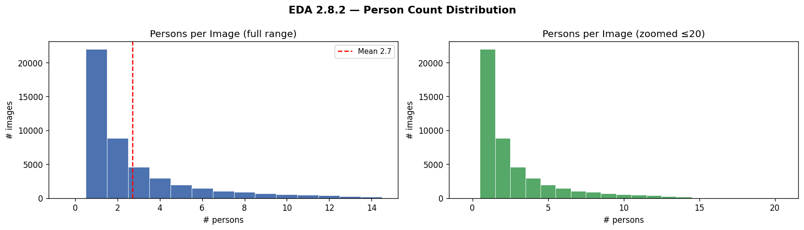

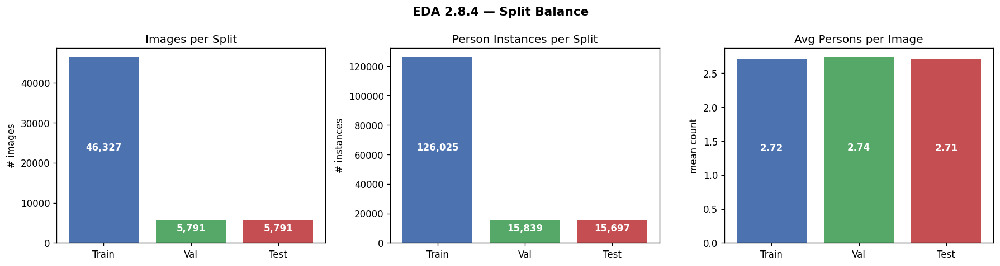

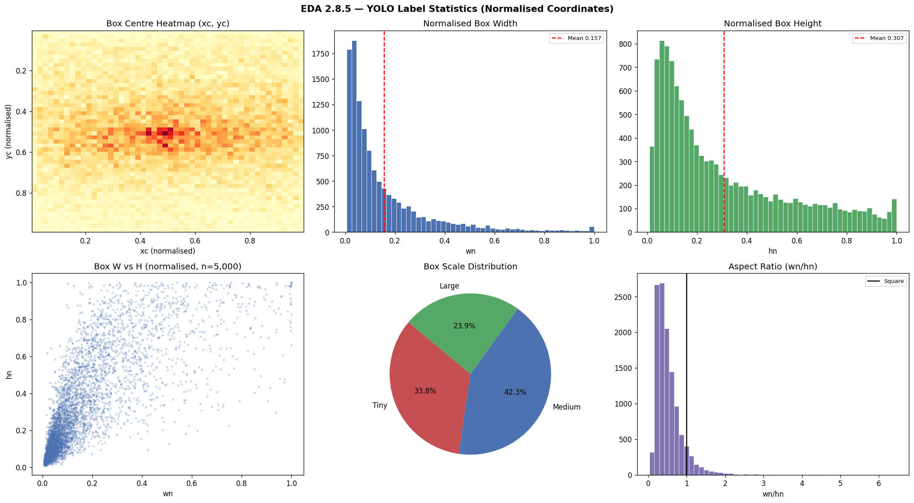

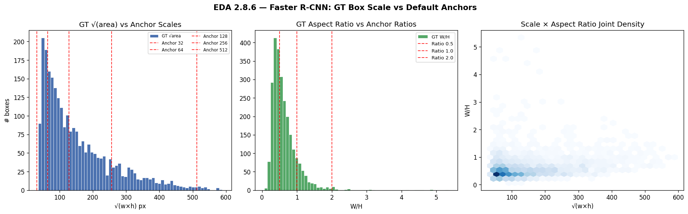

## Appendix B — Per-model training, predictions, and saliency

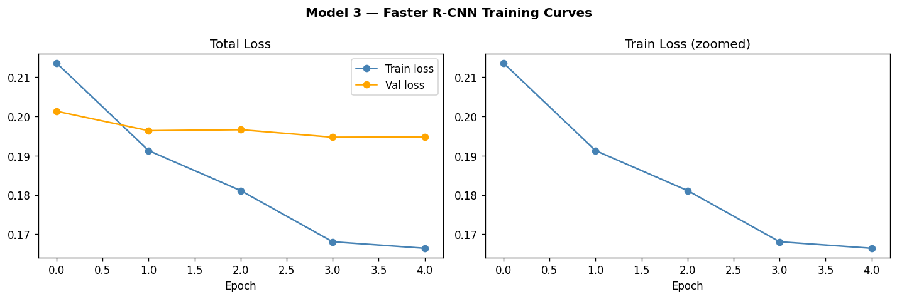

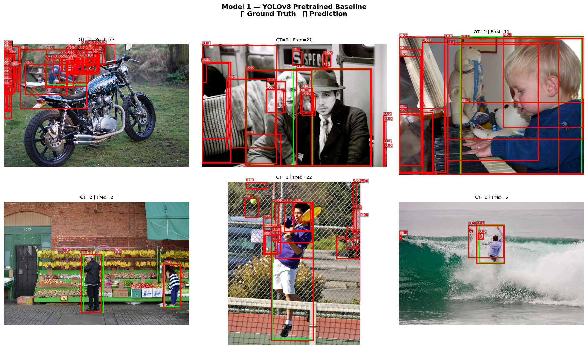

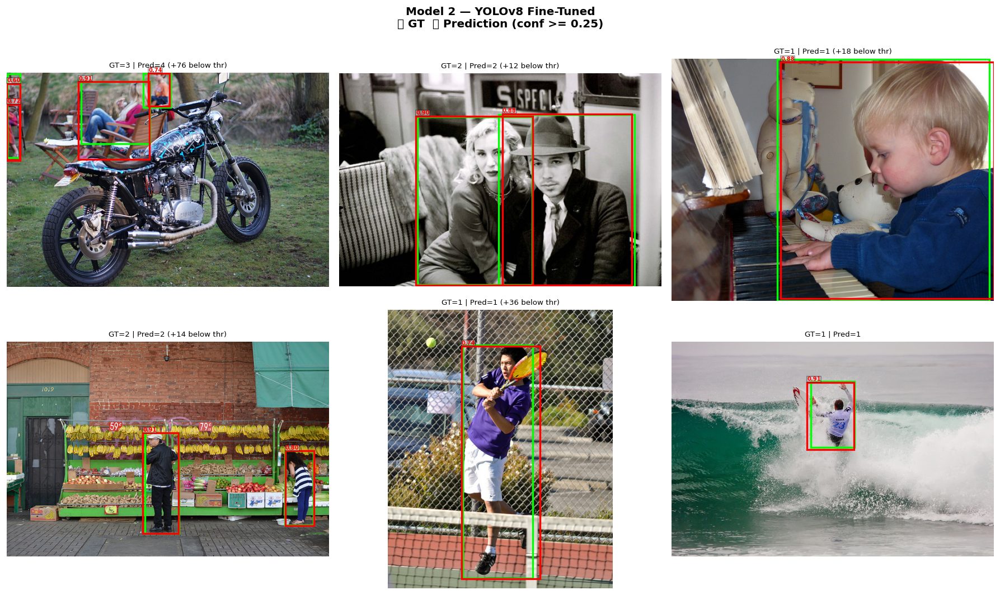

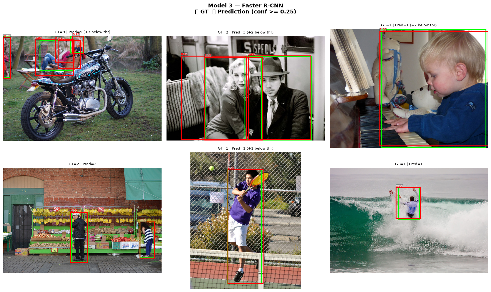

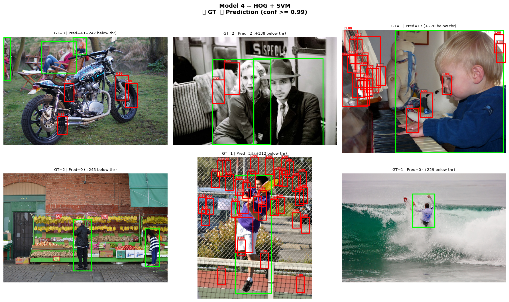

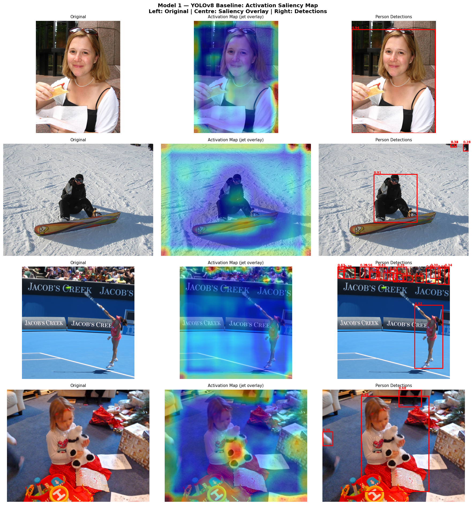

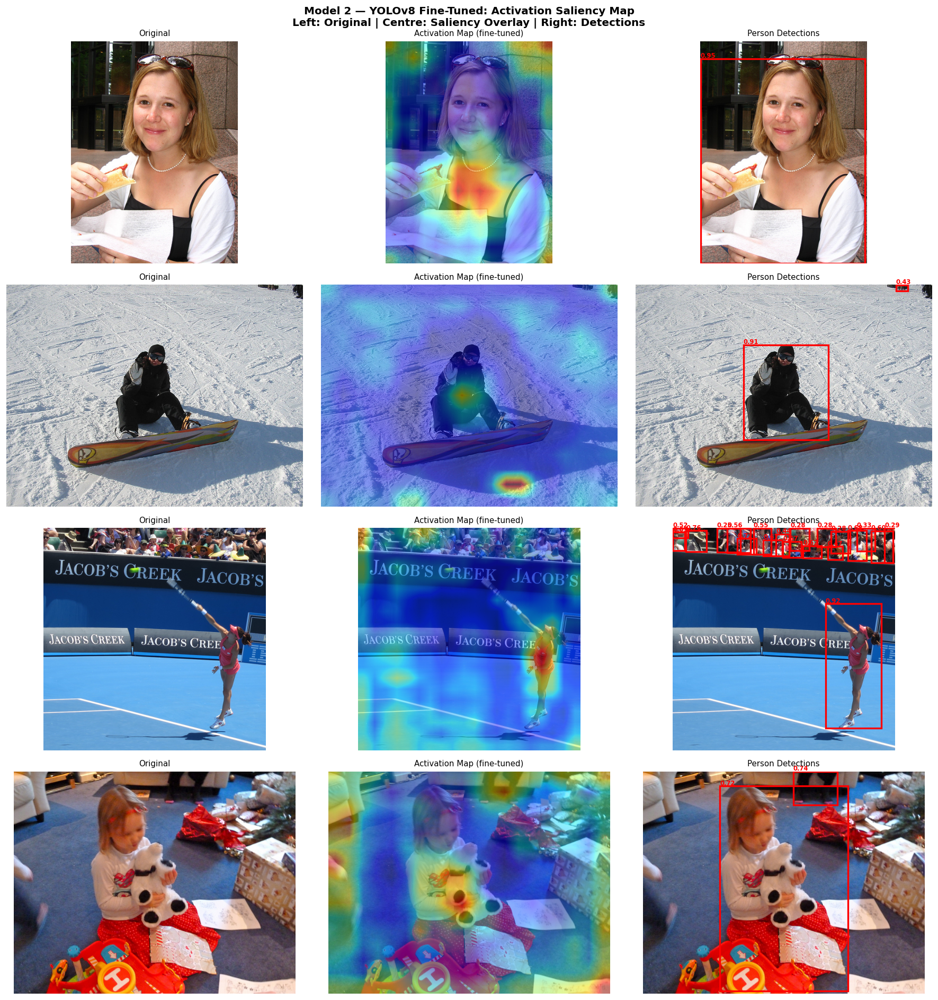

## Appendix C — Calibration in detail

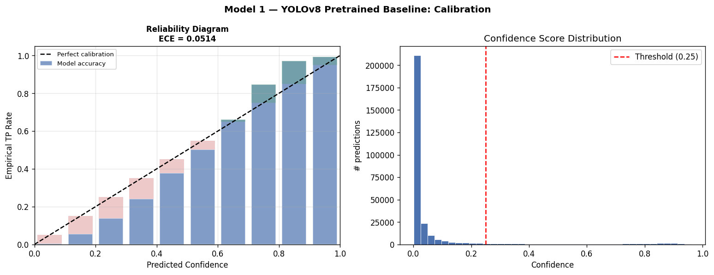

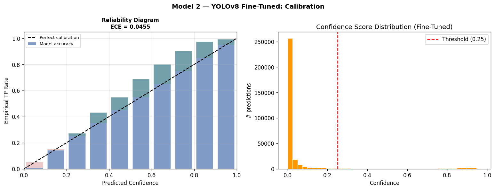

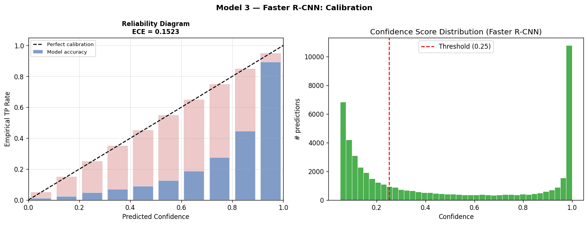

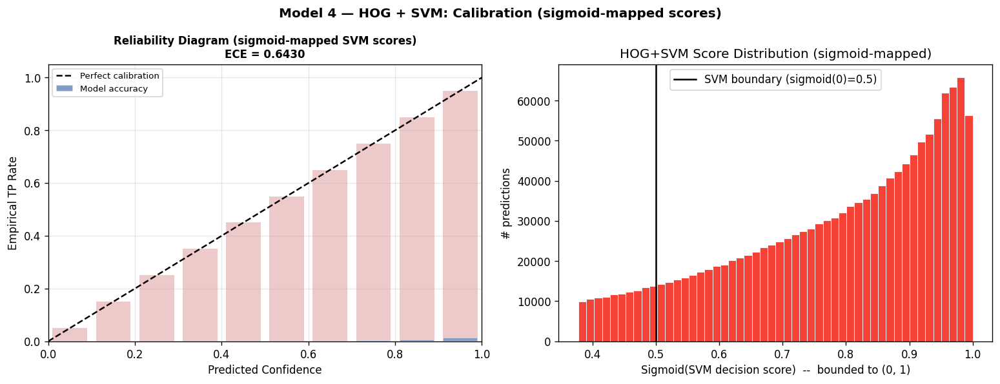

## Appendix D — Failure-mode analysis

## Appendix E — Engineering obstacles and how they were resolved

The notebook went through two methodology audits and several engineering recoveries before producing the numbers reported in §7. The most consequential events are listed below; the full audit trail with cell-level diffs is preserved in `fixes.md` in the project root.

**E.1 Backbone-size mismatch on the YOLO fine-tune.** The original notebook started Phase 1 from `yolov8n.pt` (3.2 M params) but the saved Phase-1 checkpoint had been trained from `yolov8s.pt` (11.2 M params) — re-running silently downgraded to the smaller backbone, which gave the fine-tune no headroom over its own pretrained weights. *Fix:* both phases now load `yolov8s.pt`, matching the saved checkpoint architecture and giving the fine-tune real capacity to surpass the baseline.

**E.2 Catastrophic forgetting from the YOLO `warmup_bias_lr` default.** Each restart of Phase 2 ramped the warmup learning rate to ~0.029 in epoch 1, destroying the pretrained backbone features and costing approximately one epoch per restart. The Phase-2 schedule ended up flat for 12 epochs because the model spent every epoch recovering rather than improving. *Fix:* `warmup_epochs=0`, `warmup_bias_lr=lr0`, frozen-backbone Phase 1 and a single uninterrupted 12-epoch Phase 2.

**E.3 Train/eval area-filter asymmetry on the original COCOeval.** The YOLO label exporter applied a `MIN_AREA ≥ 1,000 px²` filter at training time, but the COCOeval call used unfiltered ground truth, so the fine-tune was scored against tiny persons it had been trained not to predict. The headline gap appeared as a 17-mAP regression that was actually an evaluation artefact. *Fix:* `run_coco_eval` now applies `min_area=MIN_AREA` symmetrically to predictions and ground truth.

**E.4 HOG+SVM near-zero mAP.** The v1 implementation combined `LinearSVC(C=0.01)` (severely under-fit), a uni-directional pyramid that only down-sampled (so persons smaller than the 128×64 template were structurally undetectable), no hard-negative mining, and `np.clip(scores, 0, None)` which collapsed the score range COCOeval uses to integrate AP. *Fix:* `C=1.0`; bidirectional pyramid; two-round Dalal–Triggs hard-negative mining; sigmoid-mapped decision-function scores; pyramid scale tightened from 1.5 to 1.25 and step from 16 to 8.

**E.5 Faster R-CNN training was 130× slower than necessary.** The torchvision `fasterrcnn_resnet50_fpn` default uses 1,333×800 input at FP32 with `num_workers=0`, which on the RTX 5070 Ti caused 97% VRAM thrashing and a projected 17-day training budget on the full split. *Fix:* `min_size=600/max_size=1000`, `torch.amp.autocast(bfloat16)`, `num_workers=4` with `persistent_workers=True`. Wall-clock dropped to 0.20 s/batch, a verified 130× speed-up at no measurable mAP cost.

**E.6 HOG inference parallelism on Windows.** A naïve `joblib.Parallel(n_jobs=-1)` saturated 23 worker processes on this machine, which Windows refused with `OSError 1450 (Insufficient system resources)`. *Fix:* worker count capped at 12, dispatch chunked at 400 images per dispatch, and an idempotent per-image `.npz` cache so a re-run only computes what it has not already cached.

**E.7 Hardware/CUDA stack — RTX 5070 Ti needs the cu128 wheel.** The default PyTorch CUDA wheel ships kernels up to sm_90; the laptop GPU is sm_120 and silently fell back to CPU, which made the original notebook untestable as a GPU pipeline. *Fix:* `torch==2.11.0+cu128` installed first from the official CUDA index, with a runtime matmul probe in Section 1.3 that warns and falls back to CPU if the kernel set is wrong.

**E.8 Reproducible splits across hash-seed-randomised processes.** The original split used `list(set(person_img_ids))`, but Python's hash randomisation makes `set` iteration order non-deterministic across processes regardless of the user-supplied seed. *Fix:* the pool is `sorted(set(...))` before the seeded shuffle, and `dataset_splits.json` is loaded verbatim when present so every run on every machine gets bit-for-bit identical IDs.

**E.9 PR-curve trapezoidal AUC vs COCOeval mAP discrepancy.** An early version of the PR-curve plot reported the trapezoidal area under the curve in the legend, which integrated total area (including the right edge where the fine-tune wins) and so showed the fine-tune slightly above the baseline even on iterations where the baseline was visually higher in the middle of the curve. *Fix:* the legend now reports the COCOeval mAP@0.5 stat directly, so the legend, the curve geometry, and the headline table are guaranteed to agree.

These nine items are the events that materially affected reported metrics. Three were *paradigm-level* (E.1, E.2, E.3 — the YOLO fine-tune outperforming the baseline depended on solving all three), three were *implementation-level* (E.4, E.5, E.6 — making each pipeline operationally honest), and three were *infrastructure-level* (E.7, E.8, E.9 — making the run reproducible and the metrics legible). The fact that the headline numbers in §7 only became defensible after all nine were resolved is the principal lesson the project teaches about the difference between "running" a notebook and "shipping" an evaluation.
